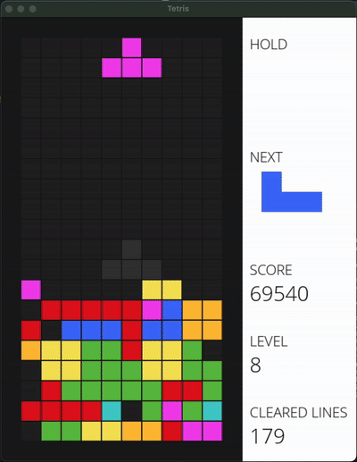

# 🧩🎮 Tetris Game with Deep Q-Learning 🧠





Welcome to the **Tetris Game AI Project**! This is a fresh take on the classic Tetris game — built with Pygame and powered by an AI trained using **Deep Q-Learning (DQN)**. The cool part? The AI learns how to play entirely through trial and error... and it's actually really fun to watch it figure things out! 😄

---

## 🎮 Game Overview
The Tetris game is rendered with a grid-style UI using `pygame`, complete with score tracking and levels. The AI learns to play by observing the game state and taking actions (drop position, and rotation).

The game environment provides feedback (rewards) based on survival, collisions, and clearing lines.

---

## 📂 Modes
Choose from one of three gameplay modes in `train_tetris.py`:

### 1. `"play"` 👾 Manual Mode
Play the game yourself using the arrow keys!
```python
mode = "play"
```

### 2. `"train"` 🤖 AI Training Mode
Train the AI agent using Deep Q-Learning.
```python
mode = "train"
```

### 3. `"test"` 🧪 Watch the Trained Agent
Watch the AI agent play the game after training.
```python
mode = "test"
```

After choosing the mode, run the following line:
```python
python train_tetris.py
```
---

## 🛠️ How To
### ✅ Requirements
Make sure you have Python 3.7+ and install the required dependencies:
```python
pip install pygame torch numpy
```

---

## 🎓 AI Agent Overview
The agent uses a DQN with the following input features:
- Rows cleared
- Bumpiness
- Holes
- Landing height
- Row transitions
- Column transitions
- Cumulative wells
- Eroded piece cells
- Aggregate height

It gets rewarded for:
- ✅ Number of cleared lines
- ❌ Gameover penalty

The agent uses experience replay and epsilon-greedy exploration to learn effective strategies from past episodes.

---

## 💾 Saving & Loading
The agent model is saved to weight.pth after training.
You can load it back in test mode to watch it play.

---

## 🧠 Bonus: Train Smarter
Modify training parameters in DQNAgent like:
- number of episodes
- epsilon_decay
- batch_size
- gamma (discount rate)
- DQN hidden layers

---

## 📬 Contact
Made with ❤️ by Ali Mahdi. Feel free to reach out with questions, suggestions, or cool ideas!
